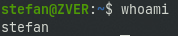
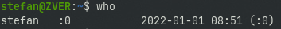
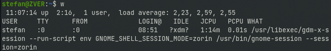
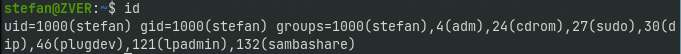

Into this tutorial we will learn how to identify a user account or who is logged into system with commands like who or who am i.

If multiple users use a single system, then everyone may have their own user account. At this time, it will be helpful to know who is logged in and the user account details.

## whoami

To know about the system’s username use the following command.

```
whoami
```



Check into the above table , ‘stefan’ is our system username.

* * *

## who

To check the information about the users logged on to the system use the following command.

```
who
```



* * *

## w

Using this command we can see about the users who are logged in and what are they doing.



* * *

## id

This command used for to check your user id, primary group id, and a list of groups that belongs to that user.


